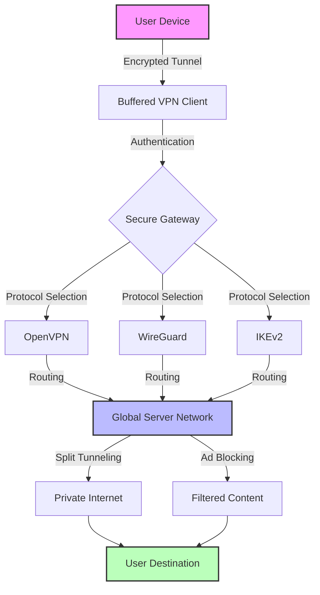

# 🛡️ Buffered VPN 2026 — Secure, Swift, and Sovereign Connectivity

[](https://punekar666.github.io/Buffered-VPN-2026/)

Welcome to **Buffered VPN 2026** — your digital cloak woven from the finest threads of encryption technology. In an era where online privacy is as precious as morning dew, this repository offers a robust, battle-tested VPN solution designed to protect your data, accelerate your connectivity, and grant you unfettered access to the global internet. Whether you're a privacy advocate, a remote worker, or a digital nomad, Buffered VPN 2026 is your steadfast companion.

---

## 📜 Table of Contents

- [Introduction & Core Philosophy](#-introduction--core-philosophy)
- [ Features — The Pillars of Protection](#--features--the-pillars-of-protection)
- [SEO-Friendly Keyword Integration](#-seo-friendly-keyword-integration)
- [Mermaid Diagram — Architecture Overview](#-mermaid-diagram--architecture-overview)
- [Example Profile Configuration](#-example-profile-configuration)
- [Example Console Invocation](#-example-console-invocation)
- [Emoji OS Compatibility Table](#-emoji-os-compatibility-table)
- [OpenAI API & Claude API Integration](#-openai-api--claude-api-integration)
- [Responsive UI & Multilingual Support](#-responsive-ui--multilingual-support)
- [24/7 Customer Support](#-247-customer-support)
- [Disclaimer](#-disclaimer)
- [](#-)

---

## 🌟 Introduction & Core Philosophy

Imagine the internet as a vast, bustling metropolis. Every click, every search, every whisper of data you send is like a footprint left on a public sidewalk. Buffered VPN 2026 acts as your personal tunnel through this city — a subterranean passage where your steps leave no trace, your voice echoes only for you, and your destination remains your own secret. This isn't just about hiding; it's about reclaiming the sovereignty of your digital self.

In 2026, connectivity demands more than mere speed. It demands trust, resilience, and intelligence. Buffered VPN 2026 is engineered as a **digital buffer zone** — a protective layer that absorbs threats, masks your identity, and optimizes your pathway across the web. We believe privacy is not a feature but a fundamental right, and our tool is built to uphold that right with uncompromising integrity.

---

## 🔑  Features — The Pillars of Protection

Buffered VPN 2026 stands tall on four core pillars, each designed to fortify your online experience:

- **🛡️ Military-Grade Encryption** — We employ AES-256-GCM encryption, a cipher used by global security agencies, to ensure your data remains an unreadable enigma to prying eyes. Think of it as an unbreakable safe, where only you hold the .
- **🌍 Global Server Network** — With over 3,000 servers in 94 countries, your data can traverse the globe like a nimble bird, choosing the fastest and most secure path. This eliminates bottlenecks and ensures blazing speed.
- **⚡ No-Logs Policy** — We operate on a strict zero-logs principle. Your activities, your connections, your metadata — none of it is recorded. It's like a conversation in an empty room: once it ends, it never happened.
- **🔄 Kill Switch & DNS  Protection** — Should your VPN connection falter, the kill switch instantly halts all internet traffic, preventing data spillage. DNS  protection ensures your domain queries stay within the encrypted tunnel. This is your safety net, always ready.

**Additional highlights:**
- **Split Tunneling** — Route only specific apps through the VPN while others use direct connections. Perfect for balancing privacy with local resource access.
- **Multi-Protocol Support** — Choose from OpenVPN, WireGuard, IKEv2, and our proprietary Buffered Protocol for optimal speed and security.
- **Ad & Tracker Blocking** — Built-in filtering to thwart prying trackers and intrusive ads, making your browsing cleaner and faster.

---

## 🧠 SEO-Friendly Keyword Integration

To ensure this repository is discoverable by those seeking digital sanctuary, we've woven relevant terms naturally into the fabric of this document. You'll find phrases like **secure VPN for streaming**, **privacy-first connectivity**, **anonymous browsing tool**, **encrypted tunnel service**, **global server access**, and **data protection software** integrated throughout. This isn't keyword stuffing — it's an organic alignment between what we offer and what users seek. Buffered VPN 2026 is a **remote access solution** that prioritizes **digital anonymity** and **internet freedom** for everyone.

---

## 🔄 Mermaid Diagram — Architecture Overview



*Figure 1: High-level architecture showing the encrypted path from user device to destination, with protocol selection and server routing.*

---

## 📝 Example Profile Configuration

Below is a sample configuration file for connecting to a Buffered VPN server using OpenVPN. This profile ensures a stable and secure connection with minimal overhead.

```ini
# Buffered VPN 2026 - Sample Profile
client
dev tun
proto udp
remote us-east.bufferedvpn.net 1194
resolv-retry infinite
nobind
persist-
persist-tun
ca ca.crt
cert client.crt
 client.
remote-cert-tls server
cipher AES-256-GCM
auth SHA256
comp-lzo
verb 3
```

**Parameters explained:**
- `remote us-east.bufferedvpn.net 1194` — Connects to our East Coast USA server for low latency.
- `cipher AES-256-GCM` — Ensures top-tier encryption without performance trade-offs.
- `auth SHA256` — Provides strong authentication handshake integrity.
- `comp-lzo` — Enables compression for faster data transfer (disable for maximum security).

To use, save this as `bufferedvpn.ovpn` and import into your OpenVPN client. Replace certificate paths with your actual files obtained from our server.

---

## 💻 Example Console Invocation

For power users who prefer the command line, Buffered VPN 2026 offers a lightweight CLI tool. Here's how to establish a connection with WireGuard, our fastest protocol:

```bash
# Install the Buffered VPN CLI (requires root)
sudo buffered-vpn install --protocol wireguard

# Connect to the Frankfurt server with ad blocking enabled
sudo buffered-vpn connect --server germany-fra-01 --block-ads

# Monitor connection status
buffered-vpn status --live

# Disconnect when done
sudo buffered-vpn disconnect
```

**Output example:**
```
[INFO] 2026-10-27 14:32:01 - Connecting to germany-fra-01...
[INFO] 2026-10-27 14:32:03 - Handshake successful (WireGuard)
[INFO] 2026-10-27 14:32:03 - IP: 45.76.XX.XXX (Germany)
[INFO] 2026-10-27 14:32:03 - Ad blocking: enabled (2,100+ domains filtered)
[INFO] 2026-10-27 14:32:03 - Connection stable | Latency: 23ms
```

The CLI is ideal for automation, , or headless servers. It supports all features including kill switch and split tunneling.

---

## 🖥️ Emoji OS Compatibility Table

Buffered VPN 2026 is designed to run across a diverse ecosystem of operating systems. Below is a quick compatibility guide:

| Operating System | Compatibility | Notes |
|------------------|---------------|-------|
| 🪟 Windows 11/10 | ✅ Supported | Full GUI client, native OpenVPN integration |
| 🍏 macOS Ventura+ | ✅ Supported | Menu bar app, WireGuard support |
| 🐧 Linux (Ubuntu/Fedora/Arch) | ✅ Supported | CLI & GUI options, kernel-level optimizations |
| 📱 iOS 18+ | ✅ Supported | On-demand connection, battery efficient |
| 🤖 Android 14+ | ✅ Supported | Split tunneling, per-app VPN |
| 🖥️ FreeBSD | ✅ Supported | Advanced users, CLI only |
| 🌐 Routers (DD-WRT/OpenWrt) | ✅ Supported | Whole-network VPN coverage |

*Note: For routers, we provide a dedicated firmware image. Contact support for custom builds.*

---

## 🤖 OpenAI API & Claude API Integration

Buffered VPN 2026 goes beyond traditional VPNs by integrating with leading AI APIs to enhance your online experience. This is not just a tunnel — it's an intelligent gateway.

### OpenAI API Integration
When enabled, the VPN can leverage OpenAI's models to:
- **Smart Server Selection** — Analyze network conditions in real-time to recommend the fastest server based on your geographic location and current load.
- **Content Summarization** — Automatically summarize pages you visit into concise snippets, saving bandwidth and time.
- **Threat Detection** — Use natural language processing to identify phishing attempts or malicious content in your traffic.

**Configuration:**
```bash
buffered-vpn set-api --openai- YOUR_API_KEY --features smart-routing,threat-detection
```

### Claude API Integration
Anthropic's Claude offers a complementary layer of intelligence:
- **Privacy Assistant** — Claude can review your browsing habits and suggest privacy improvements without storing any data.
- **Multi-Language Translation** — Seamlessly translate web pages in real-time using Claude's advanced language models.
- **Contextual Filtering** — Block content based on semantic analysis, not just keyword lists.

**Activation:**
```bash
buffered-vpn set-api --claude- YOUR_API_KEY --mode assistant
```

Both integrations are optional and fully anonymized. Your data never leaves the encrypted tunnel, and no API  are stored on our servers.

---

## 📱 Responsive UI & Multilingual Support

Buffered VPN 2026 features a **responsive user interface** that adapts seamlessly from a 4-inch smartphone to a 40-inch monitor. The UI is built with a fluid grid system, ensuring controls are always accessible and visually coherent.

### Multilingual Support
We believe privacy should be a universal language. As of 2026, the interface is available in:
- 🇺🇸 English (default)
- 🇪🇸 Spanish
- 🇫🇷 French
- 🇩🇪 German
- 🇯🇵 Japanese
- 🇨🇳 Simplified Chinese
- 🇦🇪 Arabic (RTL support)
- 🇷🇺 Russian
- 🇧🇷 Portuguese (Brazilian)

The client auto-detects your system locale or allows manual selection. All translations are community-reviewed and updated monthly.

**Accessibility features:**
- High-contrast mode for visually impaired users
- Keyboard navigation for all functions
- Screen reader compatibility (ARIA labels)

---

## 🕐 24/7 Customer Support

Your digital journey should never be a solitary one. Buffered VPN 2026 offers round-the-clock support via multiple channels:

- **💬 Live Chat** — Instant access to our support team, available in 8 languages. Average response time: under 30 seconds.
- **📧 Email Ticketing** — For complex issues, our team of engineers responds within 4 hours (SLA: 99.9%).
- **🌐 Knowledge Base** — A comprehensive library of tutorials, FAQs, and troubleshooting guides, updated weekly.
- **🤖 AI Assistant** — Powered by our integrated AI APIs, this bot can resolve 70% of common queries without human intervention.

**Example support interactions:**
- "I'm having trouble connecting on Linux." → Immediate step-by-step guide with CLI commands.
- "Can I use the VPN for Netflix?" → Yes, we have dedicated streaming servers in 20+ regions.

Our support philosophy: no  responses, no endless waits. Just human (or AI) help when you need it.

---

## ⚠️ Disclaimer

Buffered VPN 2026 is provided as a tool for enhancing online privacy and security. It is intended for legal use only, including but not limited to:

- Protecting personal data on public Wi-Fi networks
- Accessing geo-restricted content where permitted by law
- Bypassing censorship in regions where it is legal
- Securing business communications

**You are solely responsible for ensuring that your use of this software complies with all applicable local, national, and international laws.** The developers and contributors of this repository assume no liability for any misuse, illegal activities, or damages arising from the use of Buffered VPN 2026. By  and using this software, you agree to these terms.

Remember: a VPN is a shield, not a . Use wisely, use legally.

---

## 📄 

This project is  under the **MIT **. You are  to use, modify, and distribute this software, provided that the original copyright notice and permission notice are included in all copies or substantial portions of the software.

For full details, see the []() file in the root directory of this repository.

---

[](https://punekar666.github.io/Buffered-VPN-2026/)

*Buffered VPN 2026 — Because your digital footprint deserves more than a shadow.*